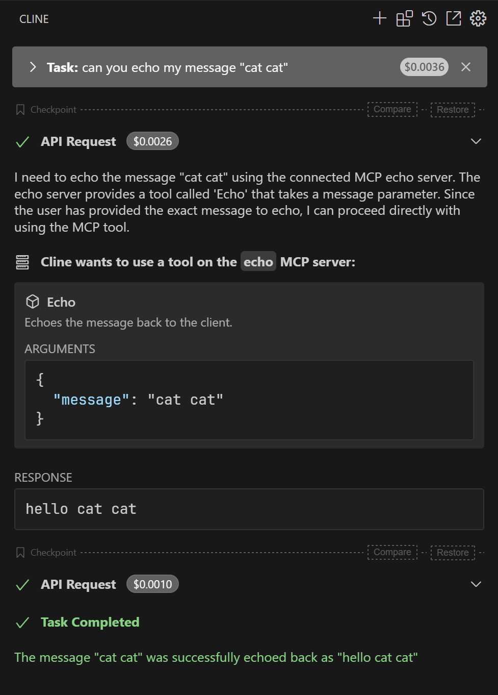

### Project Discovery
While browsing GitHub, I discovered an intriguing project: [MCP C# SDK](https://github.com/modelcontextprotocol/csharp-sdk) maintained by Microsoft. The server implementation aspect particularly caught my interest. After creating a test project to experiment with this SDK, it delivered impressive results that exceeded my expectations.

## Core Implementation Example
```csharp
using ModelContextProtocol;
using ModelContextProtocol.Server;
using Microsoft.Extensions.Hosting;
using System.ComponentModel;

var builder = Host.CreateEmptyApplicationBuilder(settings: null);
builder.Services
    .AddMcpServer()
    .WithStdioServerTransport()
    .WithTools();
await builder.Build().RunAsync();

[McpToolType]
public static class EchoTool
{
    [McpTool, Description("Echoes the message back to the client.")]
    public static string Echo(string message) => $"hello {message}";
}
```
This minimal implementation demonstrates:
* Concise syntax enabled by C#'s static type system
* Effortless tool definition through attribute annotations
* Seamless integration with Microsoft's hosting infrastructure

### Configuration Methods

After implementation, configure the compiled output in MCP-compatible clients using either approach:

Dotnet CLI Execution

```json
{
    "mcpServers": {
        "weather": {
            "command": "dotnet",
            "args": [
                "C:\\YourPath\\EchoMCP.dll"
            ]
        }
    }
}
```

Native Binary Execution

```json
{
  "mcpServers": {
    "echo": {
      "command": "C:\\YourPath\\EchoMCP.exe"
    }
  }
}
```

Validation Results：



### Distribution Advantages Analysis

The conventional MCP development workflow faced adoption challenges due to:
* Runtime dependencies (Node.js/Python) creating user friction
* Complex distribution requirements limiting end-user accessibility

The .NET NativeAOT compilation breakthrough enables:
* Single-file binary distribution
* Zero runtime dependency requirements
* Simplified deployment process
* Broader user accessibility

This technological advancement significantly improves MCP's potential for mainstream adoption beyond developer circles.